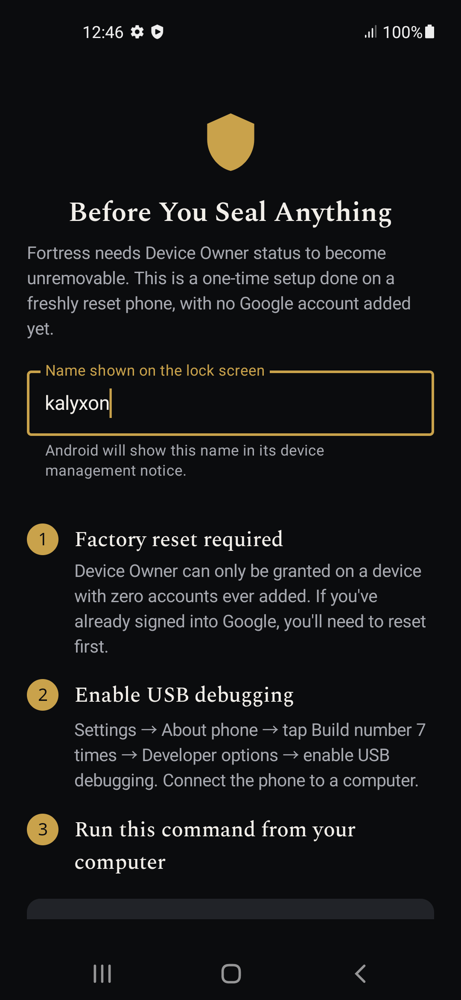
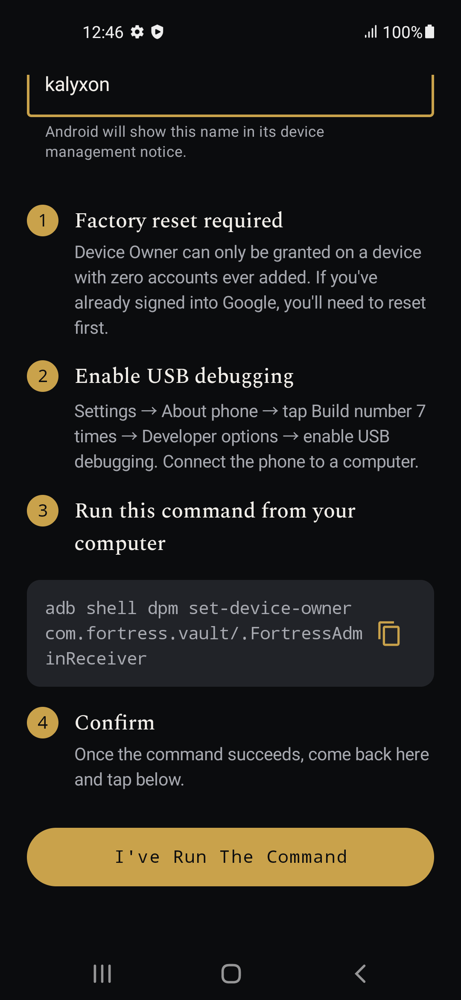
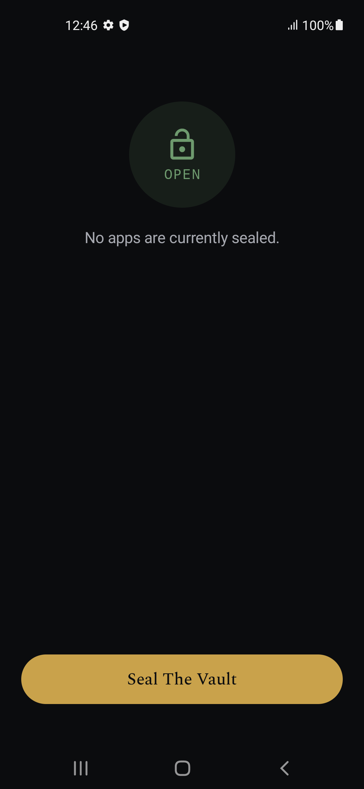
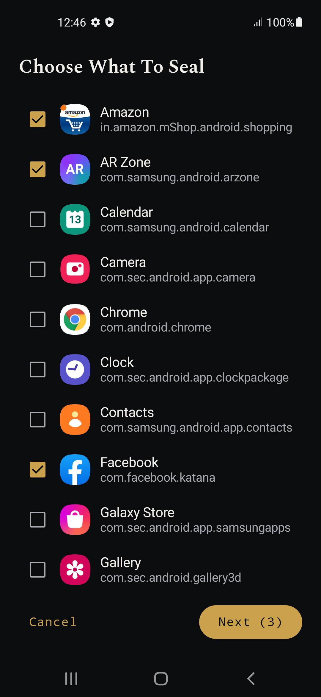
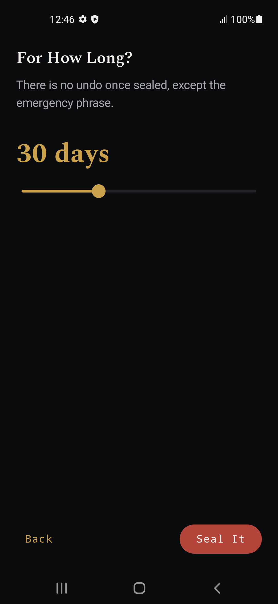
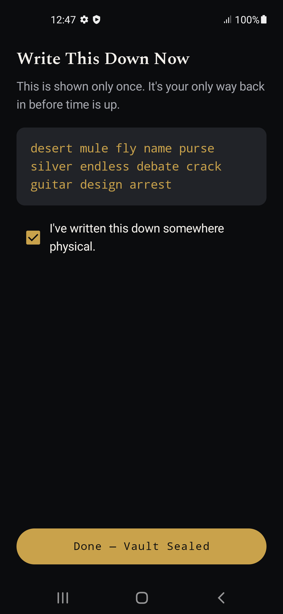
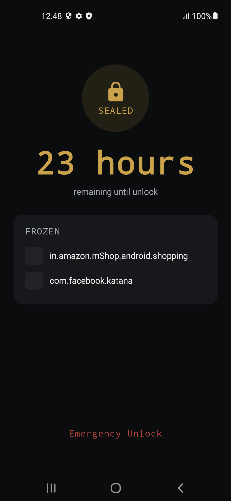
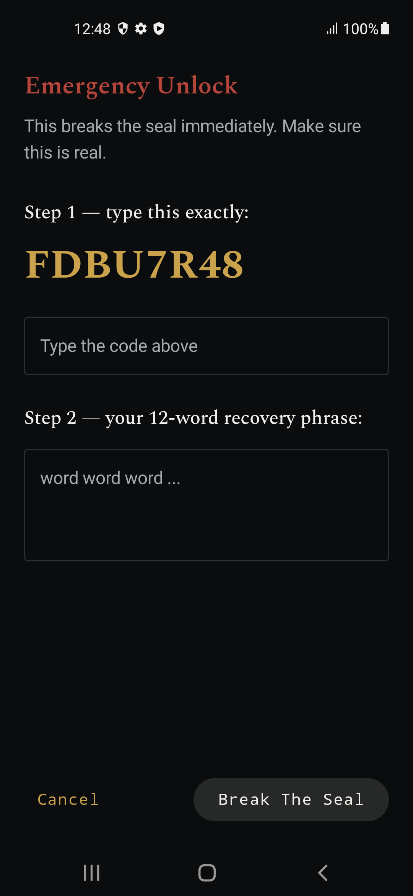

# Fortress Vault

Fortress Vault is an Android app for temporarily locking distracting apps. It
uses Android's Device Owner APIs to hide and suspend selected packages, then
enforces the lock with a foreground service and a WorkManager backup.

This is a focused device-management tool for personal experiments and
dedicated test devices. It is not a general-purpose parental-control app and
should not be treated as a security product without testing it on the exact
device and Android version you plan to use.

## What it does

- Lets you choose installed apps to block.
- Seals those apps until the configured unlock time.
- Restores the sealed state after reboot and app replacement.
- Uses network time checks to make local clock changes less useful.
- Provides an emergency recovery phrase generated from the BIP39 word list.
- Keeps a system-held copy of important sealed-state data to help it survive
  clearing Fortress Vault's app storage.

## Screenshots

### Setup



### Choose apps and set the duration




### Recovery phrase



### Vault status




### Emergency unlock





## Requirements

- Android Studio Koala or newer
- JDK 17
- Android SDK Platform 34 and compatible Build-Tools
- A physical Android device running Android 8.0 (API 26) or newer
- `adb` and a USB cable for initial provisioning

## Build

Clone the repository, open it in Android Studio, and allow Gradle to sync. The
Gradle wrapper is included, so the project can also be built from a terminal:

```bash
./gradlew assembleDebug
```

The debug APK is created at
`app/build/outputs/apk/debug/app-debug.apk`. On Windows, use
`gradlew.bat assembleDebug`.

## Install on a test device

Device Owner provisioning requires a fresh device. It normally fails if the
phone already has an account, an existing device owner, or restored setup
data. Factory reset erases the device, so back up anything important first.

1. Factory reset the phone and complete setup without adding an account or
  restoring a backup.
2. Enable Developer options and USB debugging.
3. Connect the phone and confirm that `adb devices` reports the device as
  `device`.
4. Install the debug APK:

  ```bash
  adb install -r app/build/outputs/apk/debug/app-debug.apk
  ```

5. Assign Fortress Vault as Device Owner:

  ```bash
  adb shell dpm set-device-owner com.fortress.vault/.FortressAdminReceiver
  ```

6. Launch the app:

  ```bash
  adb shell monkey -p com.fortress.vault 1
  ```

Follow the in-app setup, choose the packages to block, set an unlock time,
and store the recovery phrase somewhere secure and offline.

For a fuller installation walkthrough and troubleshooting notes, see
[`INSTALLATION.md`](INSTALLATION.md).

## Project structure

```
app/src/main/java/com/fortress/vault/
├── FortressApplication.kt         # app init, notification channel
├── FortressAdminReceiver.kt       # Layer 1 — Device Admin/Owner authority
├── MainActivity.kt                # Compose NavHost: Setup → Home → Seal/Emergency
├── core/
│   ├── VaultManager.kt            # single source of truth for sealed state
│   ├── PackageFreezer.kt          # Layer 2 — hide app + strip permissions
│   ├── TimeKeeper.kt              # Layer 3 — network-time verification
│   ├── SentinelController.kt      # starts/stops service + WorkManager backup
│   └── RecoveryPhraseGenerator.kt # emergency-unlock phrase
├── service/
│   ├── SentinelService.kt         # Layer 4 — foreground watchdog
│   └── SentinelWorker.kt          # WorkManager dead-man's-switch
├── receiver/
│   ├── BootReceiver.kt            # re-freeze before launcher loads
│   └── PackageChangeReceiver.kt   # instant re-freeze on reinstall
└── ui/
    ├── theme/                     # dark "vault" Material3 theme
    └── screens/                   # Setup, Home, SealVault, EmergencyUnlock
```

## Important limitations

- Device Owner provisioning is destructive and intended for a dedicated test
  device.
- The app is not ready for Play Store distribution as-is. `QUERY_ALL_PACKAGES`
  and Device Owner APIs require policy review; sideloading is the practical
  route for local testing.
- A recovery-mode factory reset cannot be completely blocked by a third-party
  Device Owner app.
- Android manufacturers and versions can handle policy persistence and
  background execution differently. Test the complete seal and emergency
  unlock flow on the target device.

## License

The app code is provided for this project. The bundled Spectral font is
licensed under the SIL Open Font License; its license text is in
[`licenses/SPECTRAL-OFL.txt`](licenses/SPECTRAL-OFL.txt).
