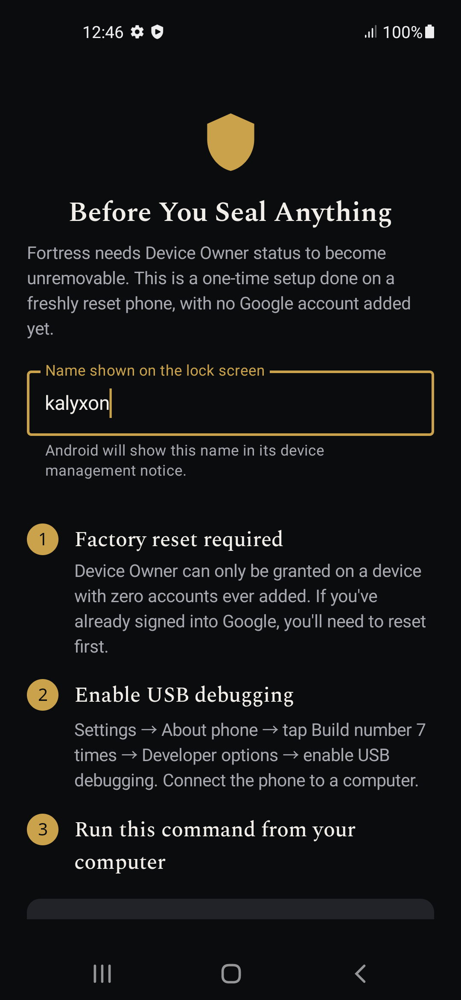
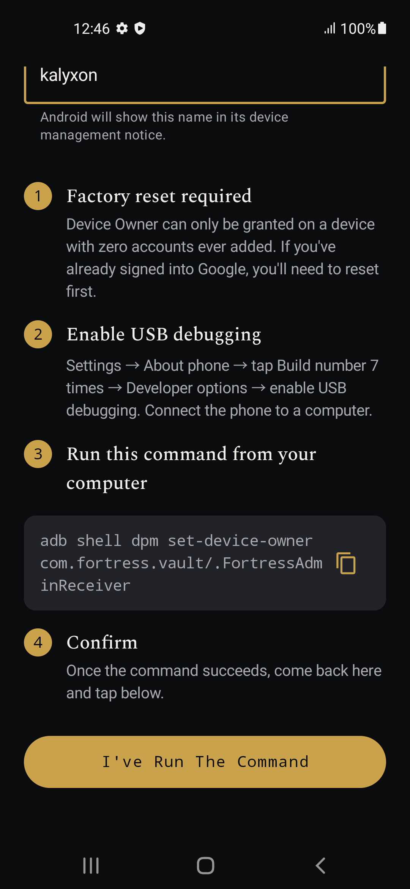
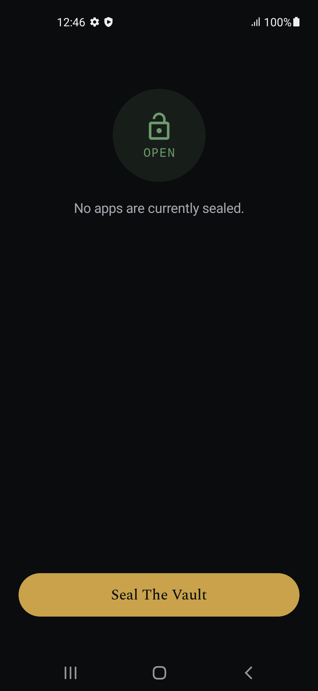
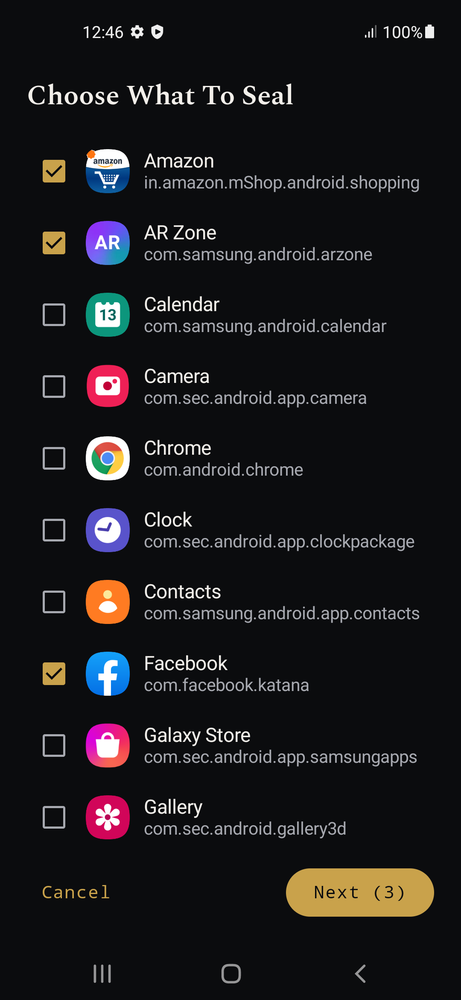
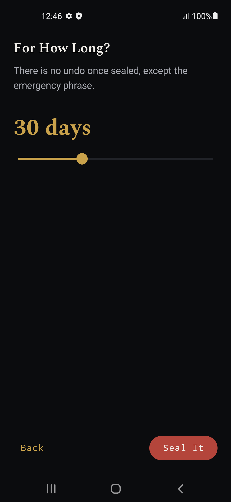
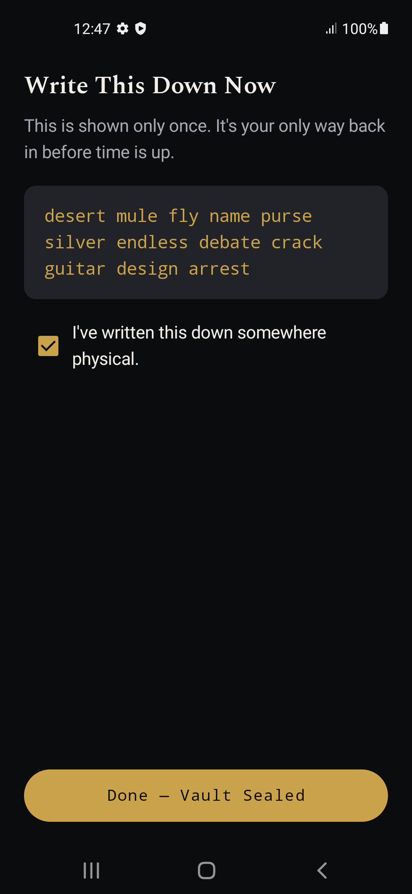
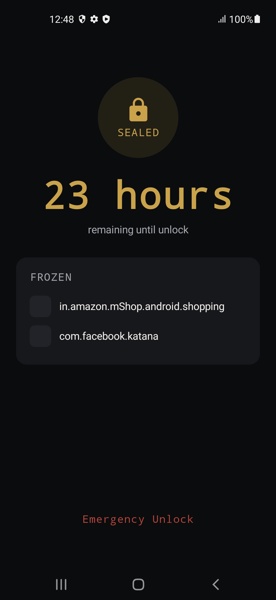
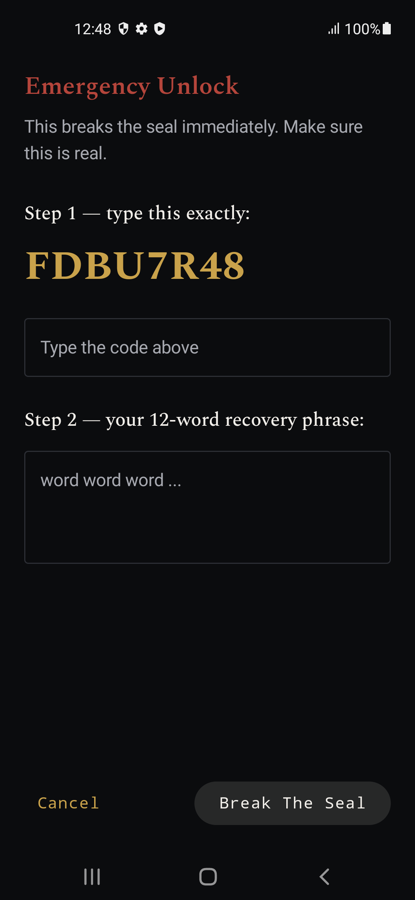

# Fortress Vault

Fortress Vault is an Android app for temporarily locking distracting apps. It
uses Android's Device Owner APIs to hide and suspend selected packages, then
enforces the lock with a foreground service and a WorkManager backup.

This is a focused device-management tool for personal experiments and
dedicated test devices. It is not a general-purpose parental-control app and
should not be treated as a security product without testing it on the exact
device and Android version you plan to use.

## What it does

- Lets you choose installed apps to block.
- Limits each seal to 20 apps to keep policy enforcement responsive.
- Seals those apps until the configured unlock time.
- Restores the sealed state after reboot and app replacement.
- Offers independent device controls for USB debugging, user accounts, and app
  installation changes, each protected by its own timer and recovery phrase.
- Requires a secure phone lock (PIN, password, or pattern) before the vault or
  device controls can be used.
- Requires device-credential verification each time Fortress returns to the
  foreground, so opening the app itself is protected by the phone's PIN,
  password, or pattern.
- Uses network time checks to make local clock changes less useful.
- Provides an emergency recovery phrase generated from the BIP39 word list.
- Keeps a system-held copy of important sealed-state data to help it survive
  clearing Fortress Vault's app storage.

## Screenshots

### Setup



### Choose apps and set the duration




### Recovery phrase



### Vault status




### Emergency unlock





## Requirements

- Android Studio Koala or newer
- JDK 17
- Android SDK Platform 34 and compatible Build-Tools
- A physical Android device running Android 8.0 (API 26) or newer
- `adb` and a USB cable for initial provisioning

## Build

Clone the repository, open it in Android Studio, and allow Gradle to sync. The
Gradle wrapper is included, so the project can also be built from a terminal:

```bash
./gradlew assembleDebug
```

The debug APK is created at
`app/build/outputs/apk/debug/app-debug.apk`. On Windows, use
`gradlew.bat assembleDebug`.

## Quick Install Guide (For Non-Developers / Easy WebADB)

If you are a user looking to install Fortress Vault without installing Android Studio or ADB command-line tools on your PC:

👉 **[Read the Easy Step-by-Step WebADB User Guide (`USER_GUIDE.md`)](USER_GUIDE.md)**

It guides you through:
1. Backing up and factory resetting your phone.
2. Installing the pre-built Release APK from **GitHub Releases**.
3. Connecting your phone to your browser via **[WebADB.com](https://webadb.com)** (no PC software download required!).
4. Running the 1-line setup command: `dpm set-device-owner com.fortress.vault/.FortressAdminReceiver`

---

## Developer Requirements & Build

- Android Studio Koala or newer
- JDK 17
- Android SDK Platform 34 and compatible Build-Tools
- A physical Android device running Android 8.0 (API 26) or newer

### Building Release APK

To build a release APK locally:

```bash
./gradlew assembleRelease
```

The signed release APK will be generated at:
`app/build/outputs/apk/release/app-release.apk`

Automated releases are built via **GitHub Actions** (`.github/workflows/release.yml`) whenever a release tag (e.g. `v1.2.0`) is pushed to the repository.

### Developer Manual Installation

1. Factory reset the phone and complete setup without adding an account or restoring a backup.
2. Enable Developer options and USB debugging.
3. Connect the phone via USB.
4. Install the release APK:

  ```bash
  adb install -r app/build/outputs/apk/release/app-release.apk
  ```

5. Assign Fortress Vault as Device Owner:

  ```bash
  adb shell dpm set-device-owner com.fortress.vault/.FortressAdminReceiver
  ```

6. Launch the app from launcher or via command:

  ```bash
  adb shell monkey -p com.fortress.vault 1
  ```

For a full troubleshooting guide, see [`INSTALLATION.md`](INSTALLATION.md) and [`USER_GUIDE.md`](USER_GUIDE.md).

## Project structure

```
app/src/main/java/com/fortress/vault/
├── FortressApplication.kt         # app init, notification channel
├── FortressAdminReceiver.kt       # Layer 1 — Device Admin/Owner authority
├── MainActivity.kt                # Compose NavHost: Setup → Home → Seal/Emergency
├── core/
│   ├── VaultManager.kt            # single source of truth for sealed state
│   ├── DeviceSecurity.kt          # secure phone-lock prerequisite
│   ├── PackageFreezer.kt          # Layer 2 — hide app + strip permissions
│   ├── TimeKeeper.kt              # Layer 3 — network-time verification
│   ├── SentinelController.kt      # starts/stops service + WorkManager backup
│   └── RecoveryPhraseGenerator.kt # emergency-unlock phrase
├── service/
│   ├── SentinelService.kt         # Layer 4 — low-frequency foreground watchdog
│   └── SentinelWorker.kt          # WorkManager dead-man's-switch
├── receiver/
│   ├── BootReceiver.kt            # re-freeze before launcher loads
│   └── PackageChangeReceiver.kt   # instant re-freeze on reinstall
└── ui/
    ├── theme/                     # dark "vault" Material3 theme
    └── screens/                   # Setup, Home, SealVault, EmergencyUnlock
```

## Important limitations

- Device Owner provisioning is destructive and intended for a dedicated test
  device.
- The app is not ready for Play Store distribution as-is. `QUERY_ALL_PACKAGES`
  and Device Owner APIs require policy review; sideloading is the practical
  route for local testing.
- A recovery-mode factory reset cannot be completely blocked by a third-party
  Device Owner app.
- Android manufacturers and versions can handle policy persistence and
  background execution differently. Test the complete seal and emergency
  unlock flow on the target device.
- A secure phone lock is mandatory for use after Device Owner setup. Fortress
  checks Android's `KeyguardManager.isKeyguardSecure`; removing the phone lock
  gates the UI again and core seal/control operations reject new changes.
- The app-change control defaults to update-friendly mode: existing apps can
  update, while newly installed packages are suspended and removed. This mode
  is limited to 90 days. Package broadcasts are the fast path; a low-frequency
  watchdog is a recovery path for devices that miss package broadcasts.
- The optional full-block mode is limited to 30 days and applies Android's
  `DISALLOW_INSTALL_APPS` and `DISALLOW_UNINSTALL_APPS` restrictions. It blocks
  new installs, app updates, and user uninstalls for the duration.
- Android does not expose a public policy that can reject only new installs
  while allowing replacements. Update-friendly mode can therefore have a
  brief interval before a new package is detected and removed. OTA/system
  updates use a separate privileged path.
- Active seal packages are suspended, hidden, uninstall-protected, and
  re-frozen after package-change events. Runtime permissions are revoked when
  Fortress freezes a package.
- Background enforcement is not free: Fortress uses a foreground service while
  protection is active. Package events handle immediate changes; the fallback
  scan runs once per minute and trusted network-time verification runs every
  15 minutes. Actual behavior varies by Android manufacturer and battery
  optimization settings.

## License

This project is licensed under the **Fortress Vault Source-Available Non-Commercial & Anti-Patent License**. See [`LICENSE`](LICENSE) for the full license terms.

- 🚫 **No Commercial Use**: Commercial sale, monetization, or inclusion in paid products is strictly prohibited.
- 🔓 **Share-Alike**: All derivative works and modifications must remain public and open under the same license terms.
- 🛡️ **Anti-Patent Protection**: Filing patents or claiming exclusive rights on these concepts, architecture, or code is prohibited.
- 🎨 **Bundled Fonts**: The Spectral font is licensed under the SIL Open Font License ([`licenses/SPECTRAL-OFL.txt`](licenses/SPECTRAL-OFL.txt)).
