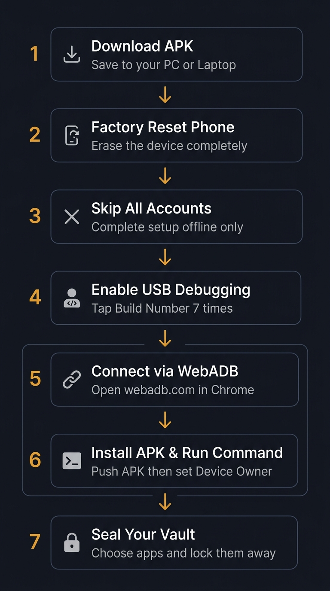

# Fortress Vault — Installation & User Guide

Fortress Vault is a free, open-source Android app that uses Android's Device Owner system to completely hide and freeze distracting apps. Because it operates at the device management level, initial setup requires a factory-reset phone and a one-time command sent over USB.

This guide covers the entire process from start to finish. No programming knowledge or additional software installations are required.

---

## Before You Begin

**What you need:**
- An Android phone running Android 8.0 or newer
- A PC or laptop with Google Chrome or Microsoft Edge
- A USB cable that supports data transfer (not a charge-only cable)
- An internet connection on the PC

**What you do not need:**
- Android Studio, ADB drivers, or any developer tools installed
- Any technical knowledge beyond following these steps

---

## Installation Overview



---

## Part 1 — Installation

### Step 1: Download the APK to Your PC

On your **PC or laptop**, open a browser and go to the Fortress Vault GitHub Releases page. Download the latest file named `FortressVault-v*.apk` and save it somewhere easy to find — your Desktop or Downloads folder works well.

Leave the file there for now. It will be installed onto your phone in Step 5 through WebADB.

---

### Step 2: Factory Reset Your Phone

> **Back up your phone before doing this.** A factory reset permanently erases everything on the device — photos, contacts, apps, and settings. Move anything important to Google Drive, a PC, or another device first.

Once you have backed up:

1. Open **Settings** on your phone.
2. Go to **System → Reset** (Samsung: **General Management → Reset**).
3. Tap **Erase all data (factory reset)**.
4. Confirm and wait for the phone to restart.

---

### Step 3: Complete the Initial Setup Without Any Accounts

When the phone restarts, it will show a Welcome or Hello screen. Work through the setup screens with the following in mind:

- **Do not sign in to a Google Account.** Look for a "Skip" or "Set up offline" option and use it.
- **Do not restore a backup** or copy data from a previous phone.
- **Do not set a screen lock** (PIN, fingerprint, etc.) at this stage. You will set one later inside the app.

Keep tapping Skip or Continue until you reach the home screen.

> **Why no accounts?** Android's Device Owner feature can only be assigned on a completely fresh device. Any existing account — Google, Samsung, or otherwise — will block the setup command from working. You can sign into accounts normally once Fortress Vault is set up.

---

### Step 4: Enable USB Debugging

USB Debugging allows WebADB to communicate with your phone from the browser.

1. Open **Settings** and scroll down to **About Phone**.
   - On Samsung, go to **About Phone → Software Information**.
2. Find **Build Number** and tap it **seven times in a row**.
   - After a few taps, you will see a message that says *"You are now a developer!"*
3. Go back to the main Settings screen.
4. Open **System → Developer Options** (or **Additional Settings → Developer Options** on some devices).
5. Find **USB Debugging** and turn it on.

---

### Step 5: Connect Your Phone to WebADB and Install the APK

WebADB runs inside your browser — there is nothing to install on your PC.

**Connect your phone:**

1. Plug your phone into your PC using the USB cable.
2. On the PC, open **Google Chrome** or **Microsoft Edge** and go to **[https://webadb.com](https://webadb.com)**.
3. Click **Add Device** on the page.
4. A small browser popup will appear listing connected USB devices. Select your phone from the list and click **Connect**.
5. **Look at your phone screen.** A prompt will appear asking *"Allow USB debugging?"*
   - Check **Always allow from this computer**.
   - Tap **Allow**.
6. The WebADB page will now show your phone as connected.

**Install the APK from your PC:**

7. In the WebADB sidebar, click **Install APK**.
8. A file picker will open on your PC. Navigate to where you saved the APK in Step 1 and select `FortressVault-v*.apk`.
9. WebADB will transfer and install the app directly onto your phone.
10. Watch your phone — you will see a notification confirming the app has been installed. The Fortress Vault icon will appear in your app drawer.

---

### Step 6: Run the Device Owner Command

This single command gives Fortress Vault its system-level blocking powers. It only needs to be run once.

1. In the WebADB sidebar, click **Interactive Shell** (or **Shell**).
2. A terminal will open inside your browser.
3. Copy the command below exactly as written:

```
dpm set-device-owner com.fortress.vault/.FortressAdminReceiver
```

4. Click inside the terminal, paste the command, and press **Enter**.
5. The terminal will print the following confirmation:

```
Success: Device owner set to package com.fortress.vault
```

That is it. You can disconnect the USB cable now.

---

## Part 2 — App Setup

Open **Fortress Vault** from your phone's app drawer and follow these steps to configure the vault.

---

### Confirm Device Owner

On the first screen, tap **"I've Run The Command"**. The app will verify that Device Owner was set correctly and confirm it on screen. If it does not confirm, make sure the command in Step 6 completed without any error message.

---

### Set a Screen Lock

Fortress Vault requires the phone to have a PIN, password, or pattern. This prevents anyone from accessing the app without your knowledge.

If your phone does not have a lock set up yet, the app will prompt you to create one. Tap **Open Security Settings**, set up a PIN or pattern, then return to Fortress Vault.

---

### Select Apps to Block

1. Tap **Create New Seal**.
2. A list of your installed apps will appear.
3. Select up to 20 apps you want blocked — social media, games, streaming apps, or anything else that distracts you.
4. Tap **Next**.

---

### Set the Duration

Choose how long the apps should remain blocked. You can set hours or days. The time cannot be bypassed by changing the clock on your phone — Fortress Vault verifies the time against external internet time servers.

---

### Save the Recovery Phrase

Fortress Vault generates a **12-word recovery phrase** before sealing. Write these words down on paper and keep them somewhere safe.

This phrase is the only way to unlock your apps early in a genuine emergency. Do not store it on the phone you are sealing.

Once you have written the phrase down, confirm it and tap **Seal Vault**.

---

### After Sealing

The selected apps are immediately hidden and suspended. They will not appear in your launcher, the Play Store, or in Android settings. If you restart your phone or if someone tries to reinstall a blocked app, Fortress Vault re-enforces the block automatically.

---

### Emergency Early Unlock

If you need to access a blocked app before the timer ends:

1. Open **Fortress Vault** and verify your PIN.
2. Tap **Emergency Unlock**.
3. Enter your 12-word recovery phrase.

The apps will be restored.

---

### Optional Device Controls

Fortress Vault includes additional locks that can be enabled separately, each with its own timer and recovery phrase:

- **Block USB Debugging** — Prevents anyone from connecting to your phone via ADB while the lock is active.
- **Block Account Changes** — Prevents signing in or out of accounts.
- **Block App Installation** — Prevents downloading new apps from the Play Store.

---

## Part 3 — Troubleshooting

**WebADB does not detect the phone**

Check that the USB cable supports data transfer. Many inexpensive cables are charge-only. Swipe down the notification bar on your phone, tap the USB notification, and switch the mode from *Charging* to *File Transfer (MTP)*. Also confirm that USB Debugging is still enabled in Developer Options.

---

**WebADB "Install APK" fails or shows an error**

Disconnect the device in WebADB and reconnect it. Check that USB Debugging is on. If it still fails, try a different USB port on your PC.

---

**Device Owner command returns: "Trying to set device owner but there are already users on the device"**

An account was added to the phone before the command was run. Factory reset the phone again, complete the initial setup without signing in to any account, and run the command before doing anything else.

---

**Device Owner command returns: "Device owner already set"**

Fortress Vault is already configured as Device Owner. Open the app and tap **"I've Run The Command"** — it should confirm correctly.

---

**Can I sign into Google after setup?**

Yes. Once Device Owner is confirmed in the app, you can sign into your Google Account, restore apps from the Play Store, and use the phone as normal. The only restriction during the sealed period is whatever you have chosen to block inside Fortress Vault.
